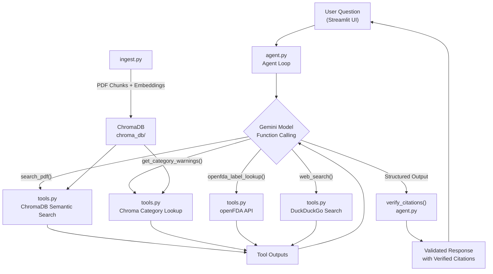

# Agentic RAG — Medical Drug-Interaction Q&A

An agentic Retrieval-Augmented Generation (RAG) web application built in Python for answering medical OTC drug interaction questions over official FDA reference documents, openFDA drug labels, and web resources with **strict, verifiable citations**.

---

## Architecture Overview



---

## Key Features

- **Strict Citation Verification**: Every answer quote is strictly verified against source document text before being presented to the user. Unverified or altered quotes are automatically dropped, orphaned citation markers `[n]` are cleaned up, and `source_summary` is recomputed.
- **Hierarchical Tool Routing**:
  1. **PDF Search (`search_pdf` / `get_category_warnings`)**: Primary source over official FDA OTC drug interaction document.
  2. **openFDA Label Lookup (`openfda_label_lookup`)**: Secondary source for prescription and specific drug label sections (with clickable DailyMed links).
  3. **Web Search (`web_search`)**: Last-resort fallback for drugs not covered in PDF or openFDA.
- **Medical Safety Protocols**: Enforces refusal of personal medical advice, diagnosis, or dosing instructions. Includes 2004 outdated-guidance disclaimers for PDF content and emergency guidance.
- **Interactive UI**: Sleek Streamlit chat interface with citation card formatting, expandable agent step execution traces, and sidebar controls.

---

## Setup & Installation

### 1. Prerequisites
- Python 3.11+

### 2. Clone & Virtual Environment
```bash
git clone https://github.com/Avvud/Agentic_rag_forDrugs.git
cd Agentic_rag_forDrugs

# Create virtual environment
python -m venv .venv

# Activate virtual environment
# Windows:
.venv\Scripts\activate
# Linux/macOS:
source .venv/bin/activate
```

### 3. Install Dependencies
```bash
pip install -r requirements.txt
```

### 4. Configure Environment Variables
Copy `.env.example` to `.env` and fill in your Gemini API Key:
```bash
cp .env.example .env
```
Edit `.env`:
```env
GEMINI_API_KEY=your_gemini_api_key_here
GEMINI_MODEL=gemini-3.5-flash-lite
EMBEDDING_MODEL=text-embedding-004
OPENFDA_API_KEY=
PDF_PATH=./data/Drug-Interactions--What-You-Should-Know-low-res.pdf
CHROMA_PATH=./chroma_db
MAX_AGENT_STEPS=5
```

---

## Execution Commands

### Run PDF Ingestion
Parse the reference PDF, compute Gemini embeddings, and index into ChromaDB:
```bash
python ingest.py
```

### Launch Streamlit Chat Application
```bash
streamlit run app.py
```

### Run All Unit & Integration Tests (Phase 0 - Phase 4)
```bash
pytest -v -s
```

Run specific phase test files:
```bash
# Phase 0: Preflight Smoke Tests
pytest tests/test_phase0_smoke.py -v -s

# Phase 1: Ingestion & Vector DB Tests
pytest tests/test_phase1_ingest.py -v -s

# Phase 2: Agent Tool Unit Tests
pytest tests/test_phase2_tools.py -v -s

# Phase 3: Citation Verification Unit Tests
pytest tests/test_phase3_verification.py -v -s

# Phase 4: End-to-End System Tests
pytest tests/test_phase4_e2e.py -v -s
```

---

## Project Structure

| File | Description |
|------|-------------|
| [config.py](file:///d:/projects/AI/Agentic%20rag/config.py) | Configuration loading and validation for environment variables. |
| [ingest.py](file:///d:/projects/AI/Agentic%20rag/ingest.py) | PDF layout parser, table/prose chunker, Gemini embeddings, and ChromaDB persistence. |
| [tools.py](file:///d:/projects/AI/Agentic%20rag/tools.py) | The 4 agent tools: `search_pdf`, `get_category_warnings`, `openfda_label_lookup`, `web_search`. |
| [models.py](file:///d:/projects/AI/Agentic%20rag/models.py) | Pydantic schemas for `AgentAnswer`, `Citation`, `ToolCall`, and `AgentResult`. |
| [agent.py](file:///d:/projects/AI/Agentic%20rag/agent.py) | Function calling loop, rate-limit backoff, and strict `verify_citations` logic. |
| [prompts.py](file:///d:/projects/AI/Agentic%20rag/prompts.py) | System prompt containing all 11 strict safety, citation, and escalation rules. |
| [app.py](file:///d:/projects/AI/Agentic%20rag/app.py) | Streamlit web application with chat UI, citation cards, and execution trace expander. |
| `tests/` | Comprehensive test suite for Phase 0 through Phase 4. |

---

## Known Limitations

1. **PDF Date**: The primary reference PDF ("Drug Interactions: What You Should Know") was published in March 2004. Medical guidance may have updated since publication.
2. **Web Search Results**: DuckDuckGo search results represent unverified third-party content.
3. **FDA Text Truncation**: openFDA drug label sections exceeding 2000 characters are truncated.
